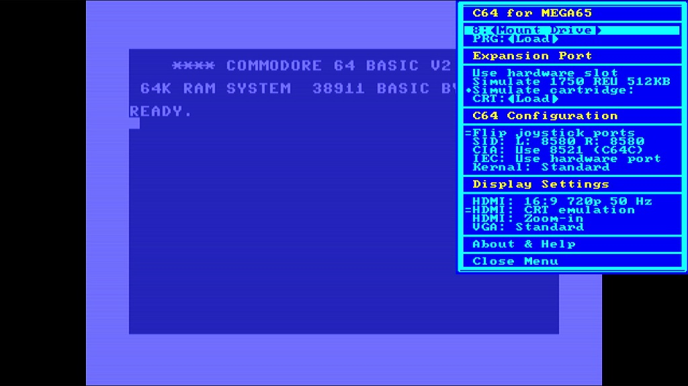
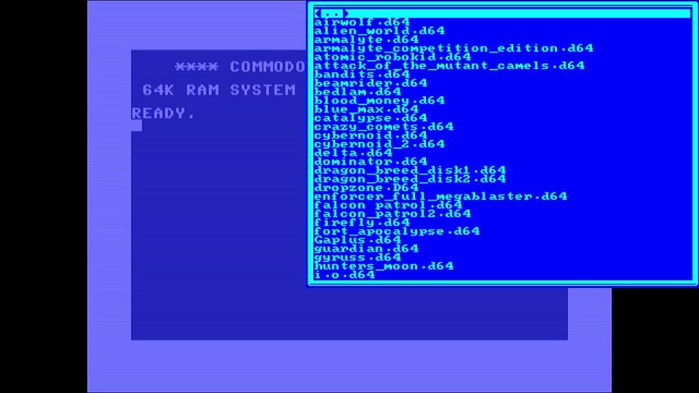
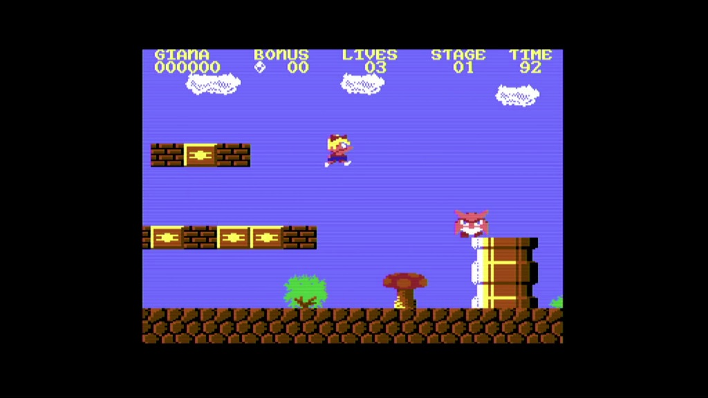
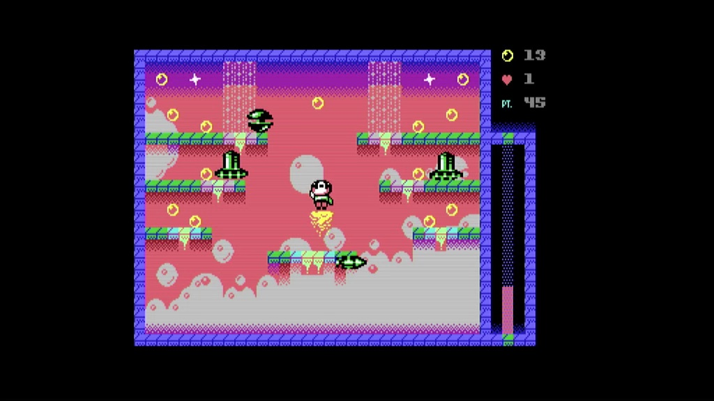
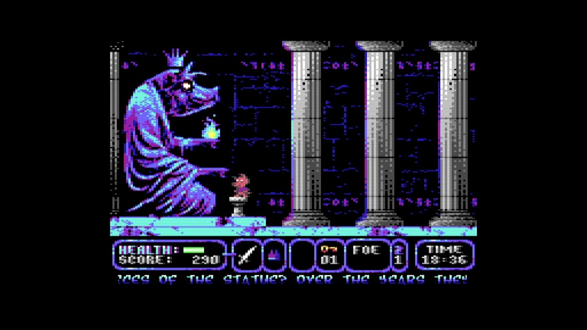

Commodore 64 for MEGA65
=======================

Experience the [Commodore 64](https://en.wikipedia.org/wiki/Commodore_64) with
great accuracy and sublime compatibility on your
[MEGA65](https://mega65.org/)!
To get a glimpse of what the C64 core can do for you,
[watch this trailer on YouTube](https://youtu.be/n3ke0alwjds?si=RT6c1nxfgn12dWsv).
Go to the MEGA65 Filehost to
[download the most recent version 6](https://files.mega65.org?id=896a012f-59e4-456c-b91f-7e989b958241)
of the C64 core.
If you are in a hurry or have issues, read the
[FAQ - Frequently Asked Questions](FAQ.md). If you are a developer
and want to build the C64 core by yourself then head to our
[developer documentation](doc/developer.md).
You can also
[learn more what's new in Version 6](VERSIONS.md).
Otherwise, enjoy the [user's guide](https://c64.mega65.org).

Credits
-------

* This core is based on the
  [MiSTer](https://github.com/MiSTer-devel/C64_MiSTer) Commodore 64 core which
  itself is based on the work of [many others](AUTHORS).
* [MJoergen](https://github.com/MJoergen) and
  [sy2002](http://www.sy2002.de) ported the core to the MEGA65 and are working
  on-again and off-again at it since 2022.
* Special thanks to
  [Amokphaze101 aka Paich64](https://github.com/paich64) for ensuring that the
  core adheres to highest [quality control standards](tests/README.md).
* Special thanks to [Kugelblitz360](https://github.com/Kugelblitz360) for the
  awesome [documentation](https://c64.mega65.org).
* The core uses the [MiSTer2MEGA65](https://github.com/sy2002/MiSTer2MEGA65)
  framework and [QNICE-FPGA](https://github.com/sy2002/QNICE-FPGA) for
  FAT32 support (loading ROMs, mounting disks) and for the
  on-screen-menu.

Comprehensive user's guide
--------------------------

Starting with version 6 of the core, we removed the documentation in this
README.md file and are pointing to the very comprehensive and great user's
guide for the C64 core.

You might want to bookmark [https://c64.mega65.org](https://c64.mega65.org).

Developers might find some additional resources in the
[doc folder](https://github.com/MJoergen/C64MEGA65/tree/master/doc)
interessting.

Features of the C64 for MEGA65 core
-----------------------------------

With our [Release 6](VERSIONS.md), we are striving for a **retro C64
experience**: The core turns your MEGA65 into a Commodore 64 with a C1541
drive (you can mount `*.d64` images) and a C1581 drive (you can mount `*.d81`
images). It supports the following hardware ports of the MEGA65:

* Joystick port for joysticks, mice and paddles
* Expansion port for C64 cartridges: Games, freezers, fast loader
  cartridges, GeoRAM, multi-function flash cartridges, etc.
* IEC port so that you can attach real 1541 & 1581 drives as well as
  printers, plotters or modern devices such as the SD2IEC

Additionally, the C64 for MEGA65 core can simulate a 1750 REU with 512KB
of RAM, it can simulate cartridges (by loading `*.crt` files) and it offers
a Dual SID / Stereo SID experience.

The C64 runs the original Commodore KERNAL and the C1541 runs the original
Commodore DOS, which leads to authentic loading speeds. You will be surprised,
how slowly the C64/C1541 were loading... :-) You can optionally
[install JiffyDOS](https://c64.mega65.org/jiffydos-and-alternative-kernals.html)
or use fast loader cartridges to speed up loading.

And you will be amazed by the 99.9% compatibility that this core has when it
comes to games, demos and other demanding C64 software. Some demos are even
recognizing this core as genuine C64 hardware. And even things like using
a fast loader cartridge while connecting a genuine 1541 via IEC are working
flawlessly.

### Video and Audio

Our philosophy on the MEGA65's outputs is that VGA is the "pure" retro-output
(and you can also switch it to 15 kHz and composite sync for a true retro
feeling) while HDMI is the "processed" modern output. So there is no
"processing" such as CRT emulation and other things on the VGA output, while
on the HDMI output several algorithms are working for a very nice looking
authentic image.

* HDMI: The core outputs 1280×720 pixels (720p) at 50 Hz and HDMI audio at
  a sampling rate of 48 kHz by default. This is supported by a vast majority
  of monitors and TVs. The 4:3 aspect ratio of the C64's output is preserved
  during upscaling, so that even though 720p is a 16:9 picture, the C64 looks
  pixel perfect and authentic on HDMI.

  If you use a 4:3 or 5:4 display via HDMI then use the option "HDMI: 4:3
  50 Hz" or "HDMI: 5:4 50 Hz" respectively to activate "PAL over HDMI";
  the core will output 720x576 pixels (576p) at 50 Hz.

* VGA: For a true retro feeling, we are providing a 4:3 image via the
  MEGA65's VGA port, so that you can connect real CRT monitors or older
  4:3 LCD/TFT displays. The resolution is 720x576 pixels and the frequency
  is 50.125 Hz in PAL mode. If your monitor supports this, you will
  experience silky smooth scrolling without any flickering and tearing.

* Retro 15 kHz RGB over VGA: This is for the ultimate retro experience:
  Connect an old SCART TV or an old RGB-capable monitor to MEGA65's VGA port.
  The core supports composite sync (CSYNC) so that SCART and other retro
  devices work flawlessly. Learn more in the dedicated documentation
  about [using analog retro cathode ray tubes](https://c64.mega65.org/hdmi-and-analog-output.html#retro-15-khz-for-cathode-ray-tubes).
  
Important: If you use VGA displays or analog retro monitors, please switch off
"HDMI: Flicker-free" as described
[here](https://c64.mega65.org/hdmi-and-analog-output.html#the-hdmi-flicker-free-option).

### Constraints and Roadmap

Our Release 6 is a mature release. Thanks to all the folks who
[contributed](AUTHORS) to the core, it is incredibly compatible to an original
Commodore 64. With our Release 6 you can play nearly all the available games
and watch almost all demos ever written for the C64. You can plug nearly
every hardware cartridge ever made for the C64 into the MEGA65's expansion
port and enjoy working/playing with it and you can work with any IEC device
(retro devices such as original 1541 or 1581 drives, printers, plotters
and modern devices such as the SD2IEC). It happens more
often than not, that the core is recognized as real hardware by software.

Yet, at this moment, our MEGA65 version of the MiSTer core is still lacking
some nice features such as:

* Mounting tapes (`*.tap`)
* Supporting G64 disk images (`*.g64`)
* Formatting disk images (`*.d64` and `*.g64`)
* Supporting MiSTer's GCR-level disk manipulation

And there is much more. Have a look at our [Roadmap](ROADMAP.md)
to learn what we plan to do in future.

Since we do this as a hobby, it might take a while until these
things are supported. So please bear with us or [help us](CONTRIBUTING.md).

Some demo pictures
------------------

|     |    |  | 
|:-----------------------------------------:|:----------------------------------------:|:--------------------------------------:| 
| *Core Menu*                               | *Disk mounting / file browser*           | *Giana Sisters*                        |
|     |    |  | 
| *Censor Design & Oxyron: Comaland*        | *Robot Jet Action*                       | *A Pig Quest*                          |

Clarification: These screenshots are just for illustration purposes.
This repository does not contain any copyrighted material.

Installation
------------

1. [Download](https://files.mega65.org?id=896a012f-59e4-456c-b91f-7e989b958241)
   the ZIP file that contains the bitstream and the core file and unpack it.
2. Choose the correct `.cor` file for your [MEGA65 model](https://c64.mega65.org/installation.html#differences-between-mega65-revisions):
   Please be aware that there are [multiple MEGA65 models](https://c64.mega65.org/installation.html#differences-between-mega65-revisions) out
   there and that each `.cor` file only works with the model that it was
   built for. So in case you are not sure, what R3/R3A, R4 and R5 means and
   which model you have, head over to the [model documentation](https://c64.mega65.org/installation.html#differences-between-mega65-revisions)
   to learn more.
2. Copy the `.cor` file on an SD card that has been formatted using the
   MEGA65's built-in formatting tool. If you want to be on the safe side, just
   use the internal SD card (bottom tray), which is formatted like this
   by default.
3. Read the section "How do I install an alternative MEGA65 core?" on the
   [alternative MEGA65 cores](https://cores.mega65.org)
   website or read the section "Bitstream Utility" in the
   [MEGA65 Starter Guide](https://files.mega65.org?id=315bbad5-f97b-4070-bab4-3ff06d5ab8ba).
4. The core supports FAT32 formatted SD cards to mount `.D64` (C1541) and
   `.D81` (C1581) disk images at drive 8.
5. If you put your disk images into a folder called `/c64`, then the core will
   display this folder on startup. Otherwise the root folder will be shown.
   If you want the core to remember the settings, make sure you read the
   section [Config file](https://c64.mega65.org/installation.html#config-file)
   in the user's guide. Starting with Version 6 the config file name includes
   the core version (for example `c64mega65-V6`). When you upgrade to a core
   with a different version, the new core does not find the old file and
   starts from the factory defaults, so re-select your settings (for example
   the Kernal) once and let the matching config file save them again.
6. Optional: Install
   [JiffyDOS](https://c64.mega65.org/jiffydos-and-alternative-kernals.html)
   and install the Real-Time-Clock (RTC) [driver for GEOS](doc/RTC.md).
7. Press the <kbd>Help</kbd> key on your MEGA65 keyboard as soon as the core
   is running to mount disks and to configure the core.
   
### Using `.bit` files instead of `.cor` files

If you are a developer and/or have a JTAG adaptor connected to your MEGA65,
then you can use the `.bit` file from the ZIP instead of the `.cor` file:
Run the [M65 tool](https://github.com/MEGA65/mega65-tools) using this
syntax `m65 -q yourbitstream.bit` and the core will be immediately loaded
into the FPGA of the MEGA65 and automatically started.

Using `.bit` files is very useful, in case you want to try out multiple cores
or core versions quickly without going through the lengthy process of
flashing `.cor` files.
