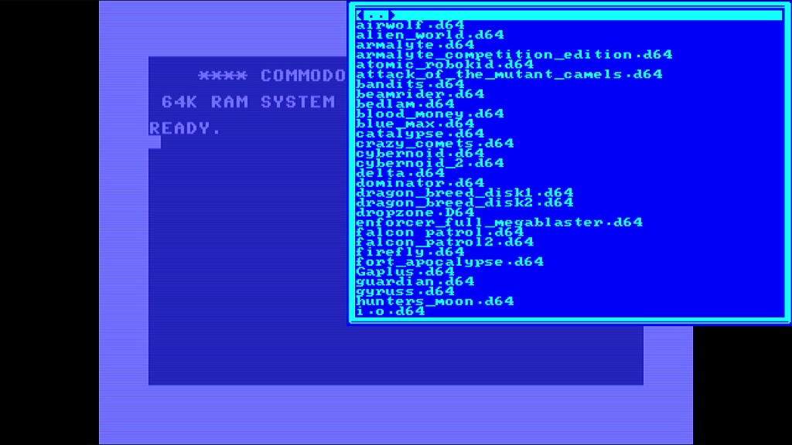
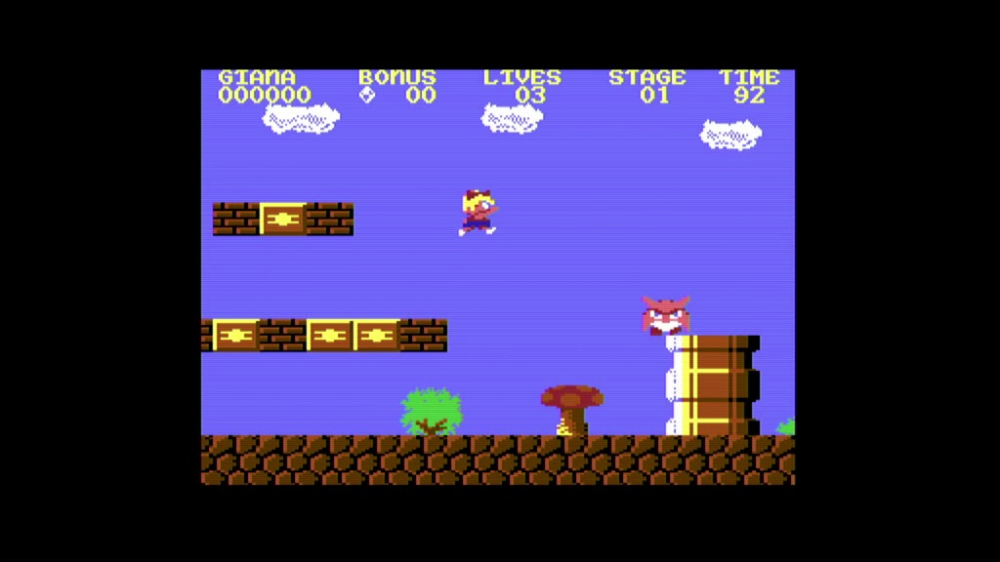
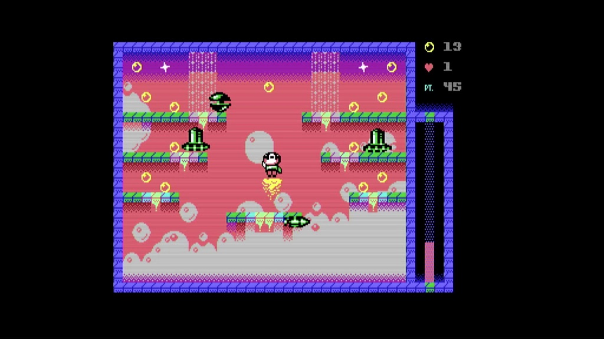
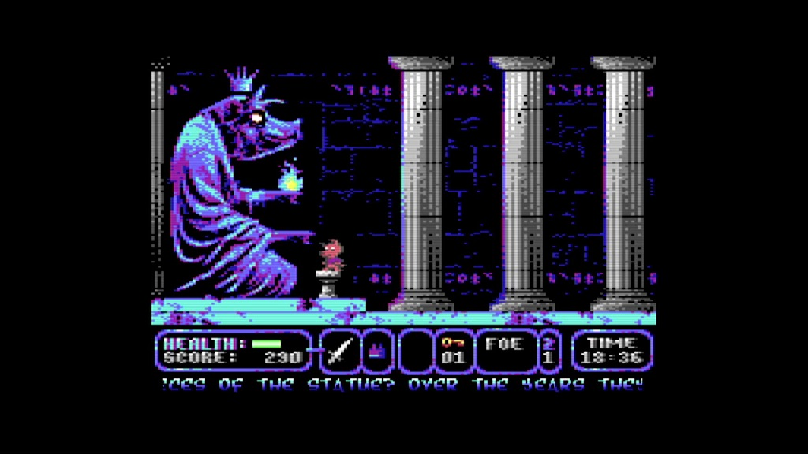

@TODO: Add description for cartridges, including what module types are
supported and link to the FAQs for troubleshooting. Also Describe the
short/long resets.

Commodore 64 for MEGA65
=======================

Experience the [Commodore 64](https://en.wikipedia.org/wiki/Commodore_64) with
great accuracy and sublime compatibility on your
[MEGA65](https://mega65.org/)! If you are in a hurry or have issues,
go to the
[FAQ - Frequently Asked Questions](FAQ.md). Otherwise, scroll down and read
the user's manual.

This core is based on the
[MiSTer](https://github.com/MiSTer-devel/C64_MiSTer) Commodore 64 core which
itself is based on the work of [many others](AUTHORS).

[MJoergen](https://github.com/MJoergen) and
[sy2002](http://www.sy2002.de) ported the core to the MEGA65 in 2022.

The core uses the [MiSTer2MEGA65](https://github.com/sy2002/MiSTer2MEGA65)
framework and [QNICE-FPGA](https://github.com/sy2002/QNICE-FPGA) for
FAT32 support (loading ROMs, mounting disks) and for the
on-screen-menu.

Features
--------

With our [Release 4](VERSIONS.md), we are striving for a **retro C64 PAL
experience**: The core turns your MEGA65 into a Commodore 64, with a
C1541 drive, a pair of Joysticks, a Mouse and/or Paddles. No frills but
optionally including a 512KB 1750 REU. The C64 runs the original Commodore 
KERNAL and the C1541 runs the original Commodore DOS, which leads to authentic
loading speeds. You will be surprised, how slowly the C64/C1541 were
loading... :-)

And you will be amazed by the 99.9% compatibility that this core has when it
comes to games, demos and other demanding C64 software. Some demos are even
recognizing this core as genuine C64 hardware.

### Video and Audio

Our philosophy on the MEGA65's outputs is that VGA is the "pure" retro-output
(and you can also switch it to 15 kHz for a true retro feeling) while HDMI is
the "processed" modern output. So there is be no "processing" such as CRT
emulation and other things on the VGA output, while on the HDMI output several
algorithms are working for a very nice looking authentic image.

* HDMI: The core outputs 1280×720 pixels (720p) at 50 Hz and HDMI audio at
  a sampling rate of 48 kHz by default. This is supported by a vast majority
  of monitors and TVs. The 4:3 aspect ratio of the C64's output is preserved
  during upscaling, so that even though 720p is a 16:9 picture, the C64 looks
  pixel perfect and authentic on HDMI.

  If you use a 4:3 or 5:4 display via HDMI then use the option "HDMI: 4:3
  50 Hz" or "HDMI: 5:4 50 Hz" respectively to activate "PAL over HDMI";
  the core will output 720x576 pixels (576p) at 50 Hz.

  In case of compatibility problems, please try the different solutions in the
  section [HDMI compatibility](#hdmi-compatibility) below.

* VGA: For a true retro feeling, we are providing a 4:3 image via the
  MEGA65's VGA port, so that you can connect real CRT monitors or older
  4:3 LCD/TFT displays. The resolution is 720x576 pixels and the frequency
  is 50.125 Hz in PAL mode. If your monitor supports this, you will
  experience silky smooth scrolling without any flickering and tearing.

* Retro 15 kHz RGB over VGA: This is for the ultimate retro experience:
  Connect an old Scart TV (for example using
  [this](https://ultimatemister.com/product/rgb-scart-cable/)
  cable) or an old RGB-capable monitor (by soldering your own cable)
  to MEGA65's VGA port.
  
Important: If you use analog retro monitors, please switch off
"HDMI: Flicker-free" as described
[here](#important-advice-for-users-of-analog-vga-and-retro-15-khz-rgb-over-vga).

### Convenience

* On-Screen-Menu via the MEGA65's <kbd>Help</kbd> key to mount disk images
  and to configure the core
* Realtime switching between a 6581 SID and a 8580 SID
* Realtime switching between 6526 CIA and 8521 CIA
* CRT filter: Optional visual scan lines via HDMI so that the output looks
  more like an old monitor or TV including authentic anti-aliasing
* Crop/Zoom: On HDMI, you can optionally crop the top and bottom border of
  the C64's output and zoom in, so that the 16:9 screen real-estate is
  better utilized and you have a larger picture. Great for games.
* Audio processing: Optionally improve the raw audio output of the system

### 512 KB RAM Expansion Unit (1750 REU)

The 1750 512KB REU is as close to cycle accurate as it can go on a MEGA65.
Remember, we are pretty constrained by the quirky HyperRAM. This means our REU
is not perfect, but 99.9% perfect: It even runs the very picky
[TreuLove_ForReal1750Reu.d64](http://csdb.dk/getinternalfile.php/144854/TreuLove_ForReal1750Reu.d64)
version of Booze Design's Treu Love demo
([see CSDB page](https://csdb.dk/release/?id=144105))
that is supposed to only run on real hardware and also the absolutely
awesome game
[Sonic the Hedgehog](https://csdb.dk/release/?id=212523)
runs like a charme on the MEGA65.

Please feel free to browse
[CSDB's REU Releases](https://csdb.dk/search/advancedresult.php?form%5Bcategory%5D=releases&rrelease_type%5B%5D=6)
and enjoy them on your MEGA65.

The REU also works perfectly with GEOS: Configure a RAM drive, copy the
programs, fonts and file you want to work with on the RAM drive and enjoy a
10x acceleration of your GEOS workflows. Don't forget to copy the results
of your work on a "real disk" (D64 data disk that you have mounted) before
ending your GEOS session so that all your data is persistently saved to the
MEGA65's SD card (see also the section
["Writing to disk images"](#writing-to-disk-images)
below).

The REU is switched off by default. You can switch it on using the options
menu.

Compatibility advise: **Only turn on the REU for software that is
explicitly supporting the REU.** Otherwise you might experience random
crashes of otherwise very stable software. Explanation: The REU itself is
99.9% compatible so you can count on it. But the majority of C64 software
does not support the REU. Some of the software even gets unstable, if you
have the REU activated. The reason for this effect is, that when the REU
is activated, certain addresses in the C64 memory space that are normally
free to be used for the software are not usable any more. If it happens
that this software needs to work with these addresses and a REU is
installed/activated, then the software crashes.

### Constraints and Roadmap

Our Release 4 is still an early release. Thanks to all the folks who
[contributed](AUTHORS) to the core, it is incredibly compatible to an original
Commodore 64. With our Release 4 you can play nearly all the available games
and watch almost all demos ever written for the C64. It happens more often
than not, that the core is recognized as real hardware by software.

At this moment, our MEGA65 version of the core is not supporting
some of the very nice hardware offerings that the MEGA65 makes, such as:

* Expansion port: Support hardware cartridges
* IEC port: Support real drives, printers, ...
* Use the MEGA65's physical drive as a C1581

Also, some things that folks would consider as "basic stuff" are not
supported yet, such as:

* NTSC mode
* Mounting tapes (`*.tap`)
* Mounting cartridges (`*.crt`)

The MiSTer core, which is the basis of this MEGA65 core offers a ton of
additional convenience features and nerdy stuff. We are not yet supporting
most of it. Have a look at our [Roadmap](ROADMAP.md)
to learn more.

Since we do this as a hobby, it might take a year or longer until these
things are supported. So please bear with us or [help us](CONTRIBUTING.md).

Some demo pictures
------------------

|     |    |  | 
|:-----------------------------------------:|:----------------------------------------:|:--------------------------------------:| 
| *Core Menu*                               | *Disk mounting / file browser*           | *Giana Sisters*                        |
|     |    |  | 
| *Neon/Triad*                              | *Memento Mori/Genesis Project*           | *Relentless*                           |

Clarification: These screenshots are just for illustration purposes.
This repository does not contain any copyrighted material.

Installation
------------

Make sure that you have a MEGA65 R3, R3A or newer. At the moment, we are not
supporting older R2 machines. If you are not sure what MEGA65 version you have
then you very probably have an R3, R3A or newer: The Devkits are R3 and the
machines from Trenz are R3A.

1. [Download](https://github.com/MJoergen/C64MEGA65/releases/download/V4/C64MEGA65-V4.zip)
   the ZIP file that contains the bitstream and the core file and unpack it.
2. Copy the `.cor` file on an SD card that has been formatted using the
   MEGA65's built-in formatting tool. If you want to be on the safe side, just
   use the internal SD card (bottom tray), which is formatted like this
   by default.
3. Read the section "How do I install an alternative MEGA65 core?" on the
   [alternative MEGA65 cores](https://sy2002.github.io/m65cores/index.html)
   website or read the section "Bitstream Utility" in the
   [MEGA65 Starter Guide](https://files.mega65.org/news/MEGA65-Starter-Guide.pdf).
4. The core supports FAT32 formatted SD cards to mount `.D64` disk images
   for the C1541 at drive 8.
5. If you put your disk images into a folder called `/c64`, then the core will
   display this folder on startup. Otherwise the root folder will be shown.
   If you want the core to remember the settings, make sure you read the
   section **Config file** below.
6. Press the <kbd>Help</kbd> key on your MEGA65 keyboard as soon as the core
   is running to mount disks and to configure the core.
   
### Config file

If you want the core to remember the settings you made in the on-screen-menu,
then make sure that you copy the
[config file](https://github.com/MJoergen/C64MEGA65/raw/V4/bin/Version%204/R3/c64mega65)
into a folder called `/c64`. This `/c64` folder needs to be located in the
root folder of the SD card that is active when you boot the core. The config
file is called `c64mega65` and is located in the ZIP file that you downloaded
from the
[MEGA 65 filehost](https://files.mega65.org?id=896a012f-59e4-456c-b91f-7e989b958241).

The very first time you start the core after you copied the `c64mega65` config
file into the `/c64` folder, it will detect the new config file and present
you with factory default settings when you press <kbd>Help</kbd> to open the
on-screen-menu. After that, the core will always save the settings when you
close the on-screen-menu and remember them when you restart the core at a
later time.

Important: If you change the SD card, for example by using <kbd>F1</kbd> or
<kbd>F3</kbd> in the file browser or by physically changing or removing the
card that contains your `/c64/c64mega65` config file, then the core will not
remember your newest on-screen-menu settings upon next start.

### Important advice for users of analog VGA and retro 15 kHz RGB over VGA

It is highly recommended to switch off "HDMI: Flicker-free" when using
analog VGA monitors or monitors that work with the "retro 15 kHZ RGB
over VGA" signal.

Otherwise you might encounter strange visual effects that range from
a blurry image to an "underwater" blurry movement of your screen.

[Learn more](#flicker-free-hdmi) about "HDMI: Flicker-free" to understand
why this is happens.

### Using `.bit` files instead of `.cor` files

If you are a developer and/or have a JTAG adaptor connected to your MEGA65,
then you can use the `.bit` file from the ZIP instead of the `.cor` file:
Run the [M65 tool](https://github.com/MEGA65/mega65-tools) using this
syntax `m65 -q yourbitstream.bit` and the core will be immediately loaded
into the FPGA of the MEGA65 and automatically started.

Using `.bit` files is very useful, in case you want to try out multiple cores
or core versions quickly without going through the lengthy process of
flashing `.cor` files.

HDMI compatibility
------------------

Right now, the C64 core is not compatible with all HDMI displays. If your
display works with the MEGA65 core but stays black when you load the C64 core,
then try this (while the display is black):

1. Boot the C64 core and wait a few seconds.
2. Press the <kbd>Help</kbd> key.
3. Press six times (6x) the <kbd>Up</kbd> cursor key.
4. Press <kbd>Return</kbd>.
5. Wait a few seconds.
6. If this does not solve the issue, continue:
7. Press four more times (4x) the <kbd>Up</kbd> cursor key.
8. Press <kbd>Return</kbd>.
9. Wait a few seconds.
10. If this does not solve the issue, continue:
11. Press one time (1x) the <kbd>Down</kbd> cursor key.
12. Press <kbd>Return</kbd>.

### Explanation: DVI mode, 60 Hz mode, 576p

The recipe above first activates the "DVI mode" as you are choosing the
menu item "HDMI: DVI (no sound)" in the on-screen-menu when you press the
<kbd>Return</kbd> key for the first time.

In DVI mode, the HDMI data stream sent by the core to your display has a
slightly different format and it does not contain any sound. You need to use
the 3.5mm audio-out in this case.

When you press <kbd>Return</kbd> for the second time, the 60 Hz mode is
activated, independent of the C64's output, which is still 50 Hz in PAL mode.
This works fine in general, but leads to some flickering and jerky scrolling
here and there.

The third press of <kbd>Return</kbd> switches from 720p to 576p.

Working with disk images
------------------------

Currently, we support D64 disk images with 35 or 40 tracks (standard format,
no error bytes). This covers 99% of all use cases. We do have support for
additional D64 disk image variants and G64 disk images on our
[Roadmap](ROADMAP.md).

### Mounting disk images

Thanks to long filename support and alphabetically sorted file- and directory
listings, mounting a disk image is straightforward. Press MEGA65's
<kbd>Help</kbd> key to open the on-screen-menu while the C64 is running
and select `8:<Mount Drive>` using the cursor keys and <kbd>Return</kbd>.
Here is how the browser works:

* Navigate up/down using the <kbd>Cursor up</kbd> and
  <kbd>Cursor down</kbd> keys
* Page up and page down using the <kbd>Cursor left</kbd> and
  <kbd>Cursor right</kbd> keys
* <kbd>Return</kbd> mounts a disk image
* <kbd>Run/Stop</kbd> exits the file browser without mounting
* Remembers the browsing history, i.e. even while you climb directory trees,
  when you mount the next image, the file selection cursor is positioned where
  you left off. This is very convenient for mounting multiple subsequent
  disks of a demo in a row.
* Support for both SD card slots: The back slot has precedence over the bottom
  slot: As soon as you insert a card to the back slot, this card is being
  used. SD card changes are detected in real-time; also while the
  file browser is open.
* Within the file browser you can use <kbd>F1</kbd> to manually select
  the internal SD card (bottom tray) and <kbd>F3</kbd> to select the
  external SD card (back slot).
* An already mounted drive can be unmounted (i.e. "switch the drive off"), if
  you select it in the <kbd>Help</kbd> menu using the <kbd>Space</kbd> bar.
  If you select an already mounted drive with the <kbd>Return</kbd> key
  instead, then for the C64 this is more like switching a diskette while
  leaving the drive on. Use the latter mechanism via <kbd>Return</kbd> when
  a game or a demo asks you to turn the disk or to insert another disk.
* The file browser defaults to the folder `/c64` in case this folder exists.
  Otherwise it starts at the root folder.
* The file browser only shows files with a valid file extension.
  Currently, we only support `.d64`.

### Writing to disk images

The C64 core supports not only reading from D64 disk images but also writing
to them (and to the MEGA65's SD cards) so that you can save your gaming
high-scores and play games that are able to save and restore the game's state.
And you can now work productively with the C64 core on the MEGA65 for example
by saving documents in GEOS or by saving your BASIC programs.

Important things to know about how writing to disk images works:

* While the C64 is saving something, the drive led is green.
* In case of an error, the led is blinking green.
* When the C64 successfully saved something then it was only written to
  an internal buffer; it is not yet written to the SD card. This is why you
  will see the drive led quickly turn from green to yellow after the C64 is
  done with saving. This is the process of actually saving all the
  changes to the SD card. It happens seamlessly in the background, you do not
  need to do anything specific.
* To prevent data corruption after saving something: Never turn the MEGA65 off
  or remove the SD card while the led is green or before the drive led turned
  yellow and went off afterwards.
* Sometimes the C64 saves things "in chunks" / "in batches", so that it might
  happen that you see the drive led being green, then yellow, then off and
  then green/yellow/off for a second or third time. Always give the system
  the time to settle before you turn it off or reset it or remove the
  SD card.
* If you did not save anything, then the drive led will not turn yellow.

Flicker-free HDMI
-----------------

When you use an emulator on your computer, you very probably will
experience jerky movements on the screen and tearing effects
because a lot of computer monitors are running at 60 Hz or higher
while the Commodore 64 had a pretty odd frequency.
Even if it would have been exactly 50 Hz, you would experience this on a
modern computer using emulation, and imagine that: The C64 is closer to
50.125 Hz than to 50 Hz, so it gets even worse... As a reference, just
start the legendary game
[The Great Giana Sisters](https://csdb.dk/release/?id=4829)
on your favorite emulator on your computer and then watch the title
scroller / intro. You will see a pretty stuttering scroller.

Not so when using an FPGA based recreation on the MEGA65 using the right
display and settings. We have your back! :-)

When using VGA or Retro 15 kHz RGB, you are safe by definition, if your
monitor plays along.

We are slowing down the whole system (not only the C64, but also the SID,
VIC, C1541, ...), so that it runs at only 99.75% of the original clock
speed of the C64. This does not decrease the compatibility of the core in
most cases and you probably will never notice.

But the advantage of this 0.25% slowdown is a clean 50 Hz signal for your
HDMI display. We believe that this is the most compatible way of providing
a flicker-free experience on HDMI.

While this works great on digital HDMI displays, there is a disadvantage on
some analog VGA monitors: The 0.25% slowdown leads to a slightly off VGA
signal timing which might lead to
[strange effects](#important-advice-for-users-of-analog-vga-and-retro-15-khz-rgb-over-vga).
This is why you should disable "HDMI: Flicker-free" when working with an
analog monitor.

### Compatibility

If you experience issues, then you can switch the core back to 100% system
speed. The menu item for doing so is called "HDMI: Flicker-free".

Please note that the C64 core will reset each time you toggle the
"HDMI: Flicker-free" switch, the system clock speed is switched between
99.75% and 100% back and forth.

Here is a small test-case for you to experience the difference by yourself:

1. Switch OFF "HDMI: Flicker-free" and load The Great Giana Sisters and
   watch the title scroller: Every ~8 seconds, you will see a jerky movement
   and tearing. The same will happen when you play the game. And this
   effect is not only there at Giana Sisters but at everything that
   scrolls and/or moves a lot of things on the screen.

2. Switch ON "HDMI: Flicker-free" and load the disk and tape magazine
   [Input 64 Issue 1/1985](https://c64-online.com/?ddownload=4459).
   You will not see the intro which consists of flying letters
   building up the word "Input 64". So here we see an example of a
   compatibility issue.

3. Switch OFF "HDMI: Flicker-free" and load Input 64 again. It now works.
   You can watch the intro.

So you have the choice: Flicker-free on HDMI or more compatibility.

Our tests have shown, that the vast majority of software works like a charm
and the value of having a completely smooth and flicker free experience on
HDMI seems therefore larger than slight compatibility issues. This is why
this feature is activated by default.

Hard-reset vs soft-reset
------------------------

If you press the reset button of your MEGA65 briefly, i.e. less than 1.5
seconds, you will do a soft-reset. A long press does a hard-reset. Here is
the difference between the two:

* Soft-reset: Do not force the reset for the C64 core. The C64 has a quite
  [sophisticated reset behavior](http://tech.guitarsite.de/cbm80.html),
  and some demos - such as
  ["That's the Way It Is"](https://csdb.dk/release/?id=11775&show=hidden) -
  make use of that, so that you can start certain parts when
  pressing the reset button. And also some games did - as a copy
  protection. This can be annoying when you want to exit a game and cannot:
  [Uridium](https://csdb.dk/search/?seinsel=all&search=uridium&Go.x=0&Go.y=0)
  and
  [Eagle's Nest](https://csdb.dk/search/?seinsel=all&search=eagles+nest&Go.x=0&Go.y=0)
  are examples for this. The bottom line is: A
  soft reset will allow you to enjoy the original behavior including "reset
  demos" but you will also be stuck with the drawbacks.

* Hard-reset: The core is doing a "forced reset" by simulating what is
  described [here](https://www.c64-wiki.com/wiki/Reset_Button) and what
  modules like the Action Replay did. This will always reset the machine.

There is another difference between the hard-reset and the soft-reset that is
more related to your convenience while using the file browser and the 
options menu:

* Soft-reset: Only reset the C64 core. Advantage: All your options/settings
  remain intact and your file browser continues where you left off. The latter
  is particularly useful when browsing large hierarchies of disk images.
  Imagine being in the fourth folder hierarchy of your disk image collection,
  browsing on page 10 of hundreds of files and then pressing reset: While
  a hard-reset let's you start over, including - again - browsing to the
  fourth folder of your disk image collection to page 10, the soft-reset
  let's you continue exactly where you left off.

* Hard-reset: The whole system is reset. All settings in the options menu
  are back to factory defaults and the file browsing starts over.

Tips for watching demos
-----------------------

The core has been tested rigorously with
[a lot of very demanding demos](tests/demos.md)
and the result is that it almost always "just works". So there are not a lot
of tips for you when it comes to watching demos but two:

1. Demos newer than the year 2000 tend to use the 8580 SID: You might want
   to switch to 8580 by default when watching these kind of demos.

2. Some demos rely on the 8521 CIA instead of the 6526 CIA which is active
   by default. Currently we know for sure of one demo where this is the case:
   "XXX" by Lethargy.
   
   All other [demos that we tested](tests/demos.md) work fine with the 6526 CIA.

Debug mode
----------

If you just want to enjoy the C64 core for the MEGA65 or if you do not have a
[JTAG adapter](https://files.mega65.org?ar=3c388c8c-bc3f-461b-84bb-e12dfd479ae2),
then you can stop reading here.

The C64 core - like all MEGA65 cores powered by the
[MiSTer2MEGA65](https://github.com/sy2002/MiSTer2MEGA65)
framework - has a debug mode that consists of a real-time log of various system
states and an interactive debug console.

To access the log and the console, connect a serial terminal to the MEGA65
using the JTAG adater while making sure that the serial terminal's parameters
are set to 115,200 baud 8-N-1, no flow control such as XON/XOFF, RTS/CTS,
DTR/DSR. Set any terminal emulation to "None" and if you can configure it,
set the send mode to "Interactive" (instead of things like "Line buffered").

To switch from the real-time log to the interactive mode, press
<kbd>Run/Stop</kbd> + <kbd>Cursor Up</kbd> and then while holding these press
<kbd>Help</kbd>.

Learn more about the debug mode in the MiSTer2MEGA65 Wiki in the "Hello World"
chapter, section
[Understanding the QNICE debug console](https://github.com/sy2002/MiSTer2MEGA65/wiki/3.-%22Hello-World%22-Tutorial#understanding-the-qnice-debug-console).
