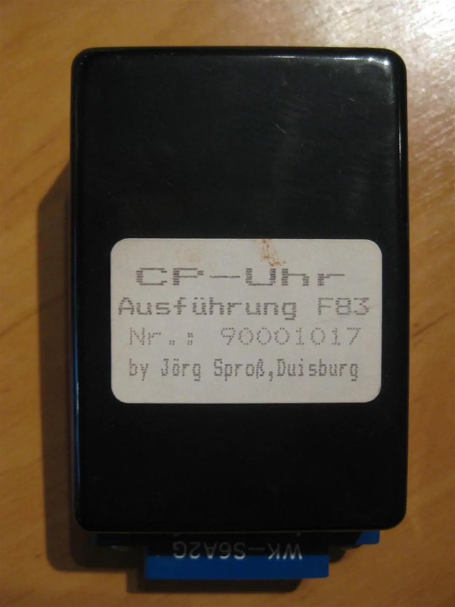

Real-Time-Clock (RTC) for GEOS
==============================

The MEGA65's Real Time Clock (RTC) is able to power the date/time in GEOS.

How to use the RTC in GEOS
--------------------------

1. Optional: [Learn how to use GEOS using C64 for MEGA65](https://github.com/MJoergen/C64MEGA65/blob/develop/FAQ.md#16-how-can-i-work-with-geos)
1. Use the MEGA65's "Configuration Utility" to set the correct date and time. Learn more in the
   [MEGA65 User's Guide](https://files.mega65.org?id=a5081244-a976-4a21-9153-27cca13fd613)
   chapter "The Configuration Utility".
2. Download the GEOS RTC driver [here](https://github.com/MJoergen/C64MEGA65/raw/master/doc/assets/CP-ClockF83_1.3.D64).
3. Use a tool like [DirMaster](https://style64.org/dirmaster) to extract the driver `CP-CLOCK-1.3.PRG` from the `.D64` file
   and to add it to your personal GEOS boot disk, which might for example be called `GEOS64.D64`.

### Differences between pre-2024 MEGA65s and 2024+ MEGA65s

* If you have a MEGA65 that has been built in 2024 or later, then you are all set.
* If you have a pre-2024 MEGA65 model, then you need to install a CR1220 battery as described in the "MEGA65 User's Guide",
  otherwise the RTC will "forget" the date/time each time you power-off your machine.
  [Here](https://files.mega65.org?ar=14d5ca1e-bc16-45d4-83f5-41b0a0545e0d)
  are instructions how to install the battery.
* A minority of pre-2024 MEGA65 are having a damaged RTCs.
  [Here](https://files.mega65.org?ar=fe2527da-52a7-4a7b-90c1-2388a4a9a981)
  is an article that describes how to request a replacement from the MEGA65 team and how to install it.
  **However, the C64 for MEGA65 core is not yet supporting the replacement RTC.**
* Learn more details about the different MEGA65 models [here](models.md).

Background and History: CP-Uhr F83 by Jörg Sproß
------------------------------------------------

From a technical perspective, we are simulating the "CP-Uhr F83" by Jörg Sproß which uses a PCF8583 chip
that is connected via the tape port. Here are some resources about the background and history of this
clock (most of them in German only):

* https://www.c64-wiki.de/wiki/RTC
* [Schematic of the CP-Uhr](http://www.zimmers.net/anonftp/pub/cbm/documents/projects/other/rtc.gif)
* [Data sheet of the PCF8583](https://www.nxp.com/docs/en/data-sheet/PCF8583.pdf)
* https://retroport.de/hardware-b-c/   (scroll down to: "CP-Uhr")

And here is an image how the original device looked like:

